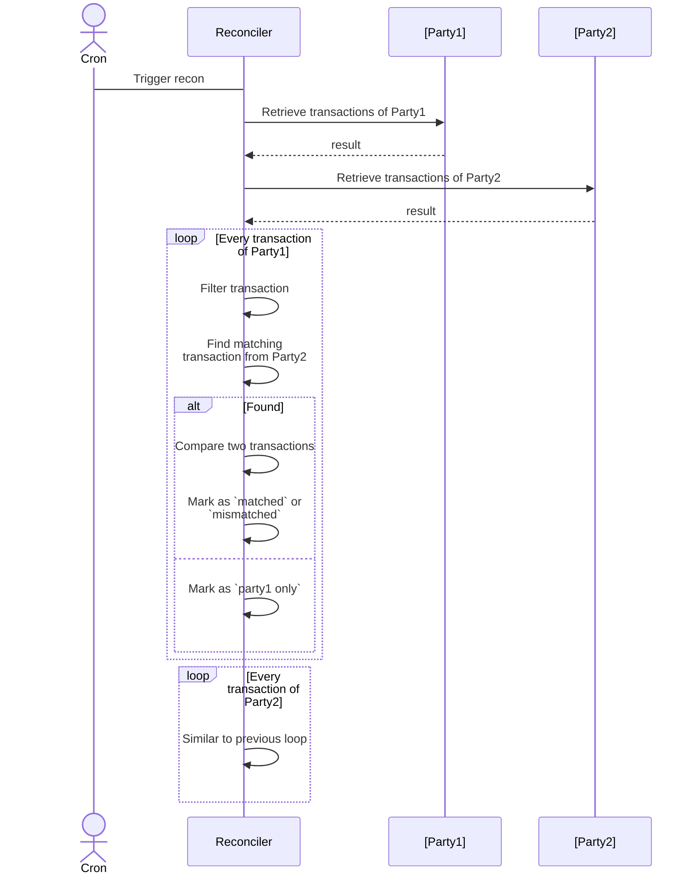

# Transaction Reconciliation
Transaction reconciliation is the process of comparing two sets of transactions from two parties in order to find matches and discrepancies.

## Flow
The core flow is illustrated below:

## Concepts
- Party: Reconciliation involves two parties.
- Collection: A collection contains transactions fetched from two parties.
- Filter: A filter uses some criteria to filter out  transactions before they can be passed over for comparison. Criteria may be a time range or a collection of statuses.
- Comparator: A comparator compares two transactions from two parties, in order to find whether they are matching.
